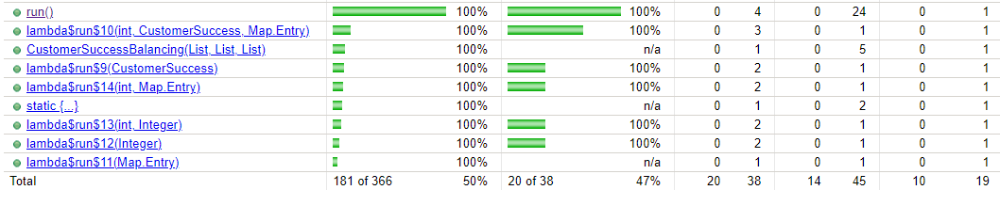
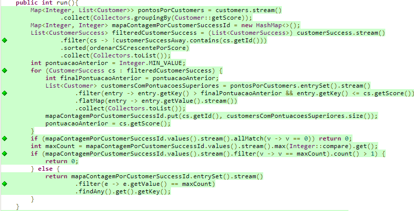

# Documentação e instruções da solução do candidato

## Cobertura de testes

Acrescentei a dependência do Jacoco à aplicação assim como o plugin para verificar a cobertura dos testes unitários aplicados. Envio a solução com tais informações já compiladas, mas caso não esteja seja possível visualizar, basta no terminal realizar os comandos "mvn clean" e depois "mvn install". Posteriormente é só executar os testes unitários. O resultado estará na pasta jacoco-resources dentro da pasta jacoco, é um arquivo index.html com resultado da cobertura.

A imagem anterior apresenta o resultado de 100% de cobertura dos testes unitários para o método run(). As linhas todas foram cobertas conforme apresentado

## Explicação técnica

A princípio, meu código apresentado seria tal como feito abaixo:

7 testes foram executados corretamente, no entanto o de performance (cenário 3 com timeout = 100) não trabalhava bem, pois o tempo de execução ultrapassava 100 ms. Portanto comecei a me concentrar também em performance além da prática de código. 

### Entendendo a lógica da primeira tentativa

Minha primeira ação foi criar uma variável map na qual armazenaria o id do CustumerSuccess como chave, e o valor seria o número Customer que ele atendeu. Então, se esse mapa ficasse vazio, seria por não ter nenhum customerSuccess atendendo. Caso não, precisaria avaliar se havia mais de uma chave com o maior valor (empate) ou não(retornando portanto o maior valor). Depois optei por ordenar a lista e filtrar descartando os CustomerSuccess away, assim criando uma nova lista, menor e mais fácil de percorrer. Tendo a lista ordenada, eu conseguiria organizar em faixas de scores, sempre verificando se o valor do score do Customer é maior do que uma pontuação e menor que outra. É isso que faço no paralellStream().foreach(). No entanto, dentro do laço eu realizava uma operação de filtragem com stream, que é mais demorada do que uma comparação. Imaginei que isso poderia estar prejudicando a performance do meu código.  Além disso, eu precisava da função index of, já que trabalhava com função lambda. E também precisaria comparar com o Score. Uma filtragem muito robusta e lenta (além de também realizar a operação map na coleção). Portanto decidi que operações dentro de coleções não deveriam acontecer no laço e optei por comparação utilizando o for. Acho que a solução com streams tem seu valor. Ela poupa memória, criamos menos variáveis e trabalha em cima de programação funcional, o que acho interessante pensando em visibilidade. 

### Como cheguei à solução final

Partindo do que falei de operação sobre os clientes, pensei em como evitar tal ação. Os clientes são da ordem do milhão, portanto creio que por isso a stream tinha uma certa demora. Para isso, comecei criando outro map, colocando ali a variável pontosPorCustomer, que na verdade é uma mapa que terá a pontuação como chave e uma lista de clientes como valor. Com isso, não preciso mais ir na lista de customer, pois tenho controle sobre a faixa de valores (lembrando que podemos ter mais de um customer com os mesmos valores). O resto foi mantido. Como optei por fazer um for, precisei criar a variável pontuacaoAnterior. Para usar dentro do laço, o próprio Java corrigiu meu equívoco criando dentro do laço a finalPontuacaoAnterior, porque, por questão de escopo, a função lambda dentro do stream não encontraria. Agora ficou uma comparação mais prática. Eu só preciso comparar com essa variável pontuação anterior e o atual elemento. Portanto, o indexOf foi eliminado e já ganhei bastante performance por isso. Além disso, realizei a operação de stream sobre o mapa, que é bem menor do que a lista de Customer, tendo um aumento de performance muito considerável por isso. O trecho final do código é mantido por ser uma verificação bem simples. 